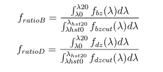
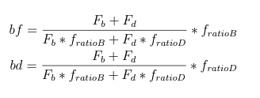
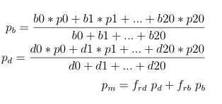

# Bulge Disk Decomposition
- We have 201 monochromatic postage stamps of single galaxies withoutneighbors obtained from Hubble Space Telescope (HST) Deep Field (HDF).
- We use Galfit to break a base galaxy into bulge and disk.
  + Try to fit two components fitting (devauc+expdisk). If this success, we take devauc as bulge and expdisk profile as disk components.
  + If the Galfit fails two components fitting, we do two single component fitting (devauc and expdisk separately).
  + If devauc is better ==> base galaxy = bulge and empty = disk.
  + If expdiskis better ==> base galaxy = disk and empty = bulge.
  + While doing fitting most of failed fitting gave better devauc than expdisk.
  + For Galfit we create two PSF files from TinyTim website, viz., psf\_f606w.fits and psf\_f814w.fits.

# Create PSF for Jedisim Using SED file and Phosim
+ Phosim needs three things: SED file, instance catalog and a background file.
+ SED file is available in Phosim Package as sed\_flat.txt. But using LSST R-band filter, we only use the wavelength range 531nm to 696 nm having transmission >= 5%.
+ We call this range 531nm - 696nm as broadband and we break this range into 21 parts. (narrowband0 is from 5310A to 5388A).
+ For background file, we choose simple background file with saturation,blooming,chargesharing,raydensity as 0.
+ For instance catalog we choose simulation time 5 mintues and other values such as given narrowband sed files.
+ Once we have three parts, we can get 21 unnormalized psf files from 21 narrowband sed files.
+ Then we make the total sum of each separate psf files equal to 1,i.e., normalize all 21 psf files.

#  Creation of Scaled Bulge, Disk, and Monochromatic Images
- We have 201 bulge and 201 disk images.
- We select cutoff redshift at 0.2 but we want to simulate galaxies at new redshift 1.5.
- We need to create 201 scaled\_bulge.fits and 201 scaled\_disk.fits with appropriate bulge to disk ratio.
- We keep sum to flux of 201 files same but change flux values of individual files.
- We have two different SED files for bulge and disk.
- We need to create bulge factor (bf) and disk factor (df).



```
f_bz = flux column from SED file related to given redshift
f_bzcut = flux column for cutoff galaxy with zcut = 0.2

lambda_0 and lambda_20 are the LSST R-band filter blue and red wavelengths.
lam0,lam20 = 5520, 6910
           = 2208,2764
(after dividing by 1+z) with z=1.5 for LSST.

For HST, we have following wavelengths
lam_hst0, lam_hst20 = 7077.5A, 9588.5A
                    = 5897.9A, 7990.4A
(After dividing 1+z with z = 0.2 for HST)
```

Then,
```
scaled_bulge = bf * bulge.fits
scaled_disk  = df * disk.fits

bf is a single value and df is a single value.
In the end we get 201 scaled_bulge and 201 scaled_disk images.
```

# PSF Creation for Bulge, Disk, and Monochromatic
From Phosim, we have created 21 narrowband psf files.
From these files, we create scaled psf files as follows:

```
pb, pd,pm = psf for bulge, disk, and monochromatic
b0,b1,...,b20 = bulge weights for 21 narrowbands.

For LSST R-band filter we have range 5520A to 6910A.
We divide by 1+z = 1+1.5 to get 2208A to 2764A.
We break this into 21 parts (making integers).
The first narrowband is 2208A to 2234A. We take the sum of flux from "ssp_pf_interpolated_z1.5.csv" and call it b0 and similarly we integrate the wavelengths of 1st narrowband from file "exp9_pf_interpolated.csv" and call it d0.
```

# Jedisim Simulation
## Create star file
- Loguniform distribution from e3 to e7 and get 300 stars.
- This star.fits file does not depend on redshift.
## PSF for Jedisim
- We have single star.fits.
- We have 3 scaled psf files: psfb.fits, psfd.fits, psfm.fits.
- We convolve these 3 psf files with the star and get image size 12288 and then rescale with LSST pixscale of 0.2 to get final size of 3398.
- The jedisim outputs also have the final shape 3398,3398.


