Table of Contents
=================
   * [Jedisim Introduction](#jedisim-introduction)
      * [Introduction](#introduction)
      * [Configuration Settings](#configuration-settings)
      * [Usage](#usage)
      * [Outputs](#outputs)
      * [Some Info](#some-info)
      * [After the jedisim](#after-the-jedisim)
      * [Schematic Diagram](#schematic-diagram)
   * [Implementation of Jedisim](#implementation-of-jedisim)
      * [Step1: Create PSF for bulge disk and mono](#step1-create-psf-for-bulge-disk-and-mono)
      * [Step2: Create Scaled Fitsfiles for bulge, disk and mono](#step2-create-scaled-fitsfiles-for-bulge-disk-and-mono)
      * [Step3: Run jedisim](#step3-run-jedisim)
   * [Technical Notes](#technical-notes)
      * [Copyright](#copyright)


 

# Jedisim Introduction
## Introduction
Jedisim is a program to generate the realistic galaxy cluster simulations from the real
galaxy observation observations.

More information can be found on:
 - jedisim/documentation/jedisim/jedisim.pdf
 - jedisim/documentation/lensing/lensing.pdf
 - jedisim/documentation/Readme.md
    
## Configuration Settings
The settings file for jedisim is `physics_settings/template_config.sh`.
We can change all physics parameter used in jedisim simulation here.
Note that the extension `.sh` for the config file is for aestehtic purpose when we open the file in a text editor
which will give nice syntax hightlight, this is not a bash script and can easily renamed be to `config.txt`
or anything else without any change in operation of the whole program.

## Usage
The jedisim program consists of multiple modules and there is a runner program which helps run the all the
related modules in an easy fashion:
```
# Run the jedisim program on the computer named pisces for redshift 0.7 for only one (start 0 to end 0)
python run_jedisim.py -z 0.7 -c pisces -s 0 -e 0

# NOTE:
# -z 0.7 is the redshift 0.7
# -c pisces is the name of the computer running the code ( I am using more than one computers to run simulations.)
# -s 0 is starting number of the simulation is 0.
# -e 0 is ending number of the simulation is 0. -s 0 -e 0 gives only one output file.
# 
# OUTPUTS:
# The final outputs are written inside **jedisim_outputs**
```

Details of modular programs:  
There are 11 sub programs inside the jedisim program. First seven sub programs `a01` to `a07`
create settings files, psfs and scaled galaxies required as the initial input for the jedisim program .
Then, we can use the script `jedisim.py` to run other scripts `a08-a11`.
```
python a01_jedisim_config.py -z 1.5  
# physics_settings: configb.sh, configd.sh, configm.sh, lens.txt

python a02_interpolate_sed.py
# sed/exp9_pf_interpolated_z1.5.csv

python a03_scaled_bd_factors.py
# physics_settings/bd_factors.txt

python a04_scaled_gals.py
# simdatabase/scaled_bulge,disk,bulge_disk f8.

python a05_bd_weights_psf.py
# physics_settings/bd_weights_z1.5.txt

python a06_scaled_bd_flux_rat.py
# physics_settings/bd_flux_rat_z1.5.txt

NOTE: Before running a07 script, we need to combine PSF Files
cd psf 
python split_psf_files.py
rm psf*
mv orig_psf/* .
rm -r orig_psf
rm psfb.fits psfd.fits psfm.fits
cd ../
python a07_psf_bdmono.py 
# psf: psfb,psfd,psfm .fits

### Now we can run jedisim.
python jedisim.py
# Runs: a08, a09, a10 and a11 scripts.

python a08_jedisim_odirs.py
# jedisim_out/out0, and out90
## scaled_bulge, scaled_disk scaled_bulge_disk

python a09_jedisim_3cats.py
# jedisim_out/out0,90/trial1_: catalog, convolvedlist, distortgedlist.txt

python a10_jedisimulate.py
# Runs: lsst_TDCR  Transform, Distort, Convolve, Rescale.

python a11_jedisimulate90.py
# Runs: lsst_TDCR  for 90 degree rotated images.
```


Dependencies:
```
# 1. astropy (pip install astropy )
# 2. util (This is my utility script.)
```

## Outputs

* Output images directory can be changed in the configuration file `physics_settings/template_config.sh`.

* For a single run, the outputs of `jedisim.py` are written inside `jedisim_out/out0` 
  and `jedisim_out/out90` directories.

* For multiple run of the same script `jedisim.py`,  there is a dedicated script `run_jedisim.py`
  which will create outputs inside `jedisim_out/FolderNameWithDate/REDSHIFT/lsst, lsst90, etc`.


## Some Info

* The original images of HST ACS WFC are splitted into bulge and disk components using `galfit`.

* The input images for jedisim are `sidmdatabase/bulge_f8` and `sidmdatabase/disk_f8`.
  Here, f8 is the `F814w` filter images I am using for the simulation. We can do it for `F606w`
  and any other bands.
  
* In fact, the correct images that are fed into the end script `jedisim.py` are the 
  `sidmdatabase/scaled_bulge_f8` and `sidmdatabase/scaled_disk_f8` which are created using the 
  script `a04_scaled_gals.py`.

* The radius database for the foreground galaxies are given in `simdatabase/radius_db`.

* The redshift database for the foreground galaxies are given in `simdatabase/red_db`.

* The source codes are in "jedisim_sources/". These are the C programs, 
  which needs to be compiled if we do any changes to these files.

## After the jedisim

* The jedisim outputs, e.g. `jedisim_out/jout_z0.7_2018_04_20_08/z0.7/lsst/lsst_z0.7_0.fits`
  are used in DMStack Mass estimation pipeline to estimate the mass of the 
  background dark matter cluster.
  
## Schematic Diagram
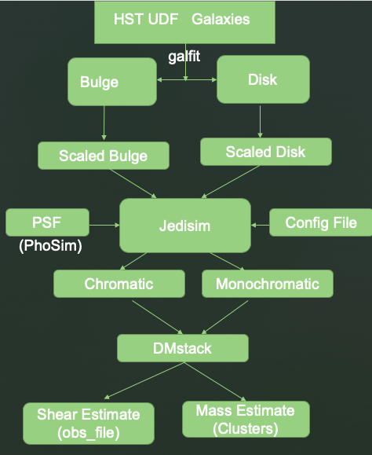

Notes:
> From Brown University Prof. Dr. Ian Del'Antonio we have obtained 200 clean galaxy images (one galaxy in one fitsfile) from
  HST ACS WFC F814W filter. Only the galaxies with no near neighbors were selected and background were subtracted using iraf.
  Each image is 601*601 dimension and has pixscale 0.06 and mag0 of 26.78. For example one file `sect23_f814w_gal0.fits` has
  `radius=14.5`, `flux=398.14`, `mag=20.28`.

> For a single galaxy (`sect23_f814w_gal0.fits`), we break it into a bulge and a disk using the software **galfit**. Every galaxies have galactic disk, but it may not have bulge. The spiral galaxies generally have both bulge and disk, however, disk galaxies may not have the bulge at the center of the galaxy. In this simulation, if there is no bulge part, we keep it zero pixeled image of the same dimension as that of the disk image. For a single galaxy image it gives two outputs: `f814w_bulge0.fits` and `f814w_disk0.fits`.

> Here the galaxy image of HST pixscale `sect23_f814w_gal0.fits` is broken into bulge and disk parts as `f814w_bulge0.fits` and `f814w_disk0.fits`. But, we want to simulate the image for LSST and LSST has different pixscale. We keep total flux of bulge+disk before
and after pixscale change. 
```
(flux_bulge + flux_disk) for HST = (flux_bulge + flux_disk) for LSST
```
We use the script `a04_scaled_gals.py` and get `f814w_scaled_bulge0.fits` and `f814w_scaled_disk0.fits`


> We choose the redshift of the HST galaxies to be $z = 0.2$, and we for simulation for LSST we use $z = 1.5$. We can also use
  other redshifts for LSST simulations such as 0.5, 0.7, 1.0 and 1.5.


> In this project we are mainly studying the effect of choice of PSF and its effect on the shear measurement of background galaxies.
 We study both wavelength dependent (i.e. chromatic) and independent ( i.e. monochromatic) effects. So, we have 3 different PSF files
 (`psfb.fits`,`psfd.fits`,`psfm.fits`) to be convolved with input galaxy cluster images.


> The final outputs of jedisim are `lsst.fits` and `lsst_mono.fits`. We also get the 90 degree rotated versions of these outputs
(keeping all other parameters unchanged) so as to reduce the intrinsic shape bias of the background galaxy sample.

> We use the DMStack Pipeline `obs_file` to get the shear estimates of the output galaxies clusters.

> We use the DMStack Pipepline `Clusters` to get the mass estimates of the galaxy clusters.

# Implementation of Jedisim
## Step1: Create PSF for bulge disk and mono
From the PHOSIM Software we have created 21 narrowband PSFs. Now we will use them to create PSF for scaled bulge, disk, and monochromatic images. The scaled psf files are given by formula:

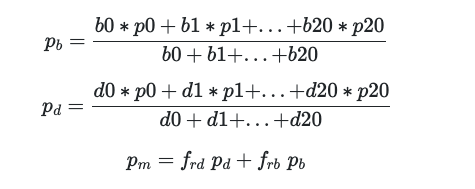

- $p_b$, $p_d$,and $p_m$ are psf for bulge, disk, and monochromatic respectively.
- $b0, b1, ..., b20$ are bulge weights for 21 narrowbands. 
- $d0, d1, ..., d20$ are  disk weights for 21 narrowbands. 
- The PSF files p0 to p20 are created using Phosim.
- The bulge and disk weights are obtained from `physics_settings/bd_weights_z1.5.txt` which is created from `a05_bd_weights_psf.py`.
- `b0 ... b20 ` are the integrated flux in the given narrowbands. 
- The LSST R-band filter blue and red wavelengths range is `5520 Angstrom` to `6910 Angstrom` (https://www.lsst.org/about/camera/features).
- We divide these wavelengths by a factor ($1 + z$) to get the range 2208 to 2764 for the redshift of 1.5.
- We divide this range 2208 to 2764 into 21 parts and get 21 narrowband ranges.
- For bulge we use `sed/ssp_pf.cat` and for disk we use `sed/exp9_pf.cat` lc catalog files.
- These SED files do not have the step size of 1 Angstrom, so we interpolate the sed and create new sed files.
- After creating new SED files, we integrate the flux in given narrowband to get the quantities `b0 b1 ... b20 etc`.

## Step2: Create Scaled Fitsfiles for bulge, disk and mono
We have total 201 number of HST images, so we have 201 bulge images and 201 disk images.
From these two folders we create so called `scaled_bulge`, `scaled_disk`, and `scaled_bulge_disk` folders. 
For this, we first find the `bulge_factor` (bf) and `disk_factor` (df) then we create scaled galaxies.

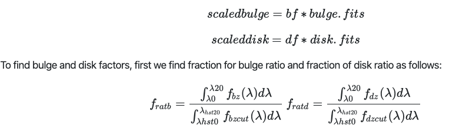
 
Here, $f_{bz}$ is the flux column from the SED file according the redshift $z$ for the bulge and $f_{bzcut}$ is the 
flux column for cutout galaxy. Here, we have used the galaxy cutout redshift as $ z_{cutout} = 0.2$. Similarly we have the flux columns for disk galaxies.

The wavelengths $\lambda_0$ and $\lambda_{20}$ are the LSST R-band filter blue and red wavelengths. This range is `5520 Angstrom` to `6910 Angstrom` [Refer here](https://www.lsst.org/about/camera/features)).
We divide these wavelengths by a factor ($1 + z$) to get the range 2208 to 2764 for the redshift of 1.5.

Similarly, for the HST the wavelengths are $\lambda_{hst0} = 7077.5 $ Angstrom and $\lambda_{hst20} = 9588.5 $ Angstrom.
After dividing by $ 1 + z = 1.2$ we get $\lambda_{hst0} = 5897.9 $ Angstrom and $\lambda_{hst0} = 7990.4 $ Angstrom. We can get more details about HST ACS/WFC filter at the [website](http://www.stsci.edu/hst/acs/documents/handbooks/current/c05_imaging2.html).

Then, we get bulge factor and disk factor using the formula:

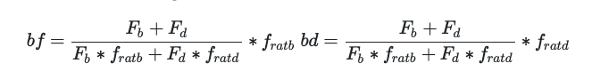
 
 where, `F_b` is the flux of a bulge file (e.g. `simdatabase/bulge_f8/f814w_bulge0.fits`) and `F_d` is the flux of a disk file (e.g. `simdatabase/disk_f8/f814w_disk0.fits`) for 201 bulge and disk files we have 201 bulge and disk factors.
 
After we get these bulge and disk factors we simply multiply them by the `bulge.fits` and `disk.fits` to get `scaled_bulge.fits` and `scaled_disk.fits`.


## Step3: Run jedisim
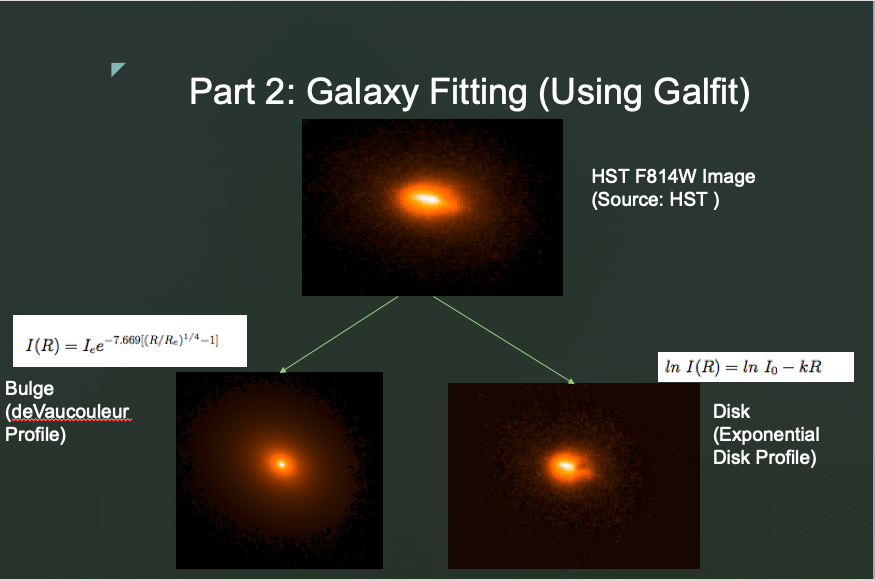
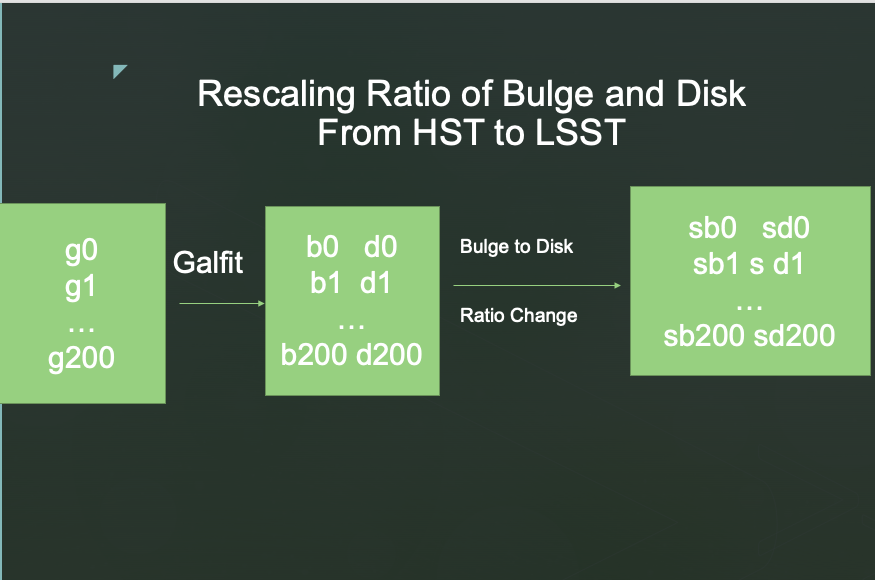
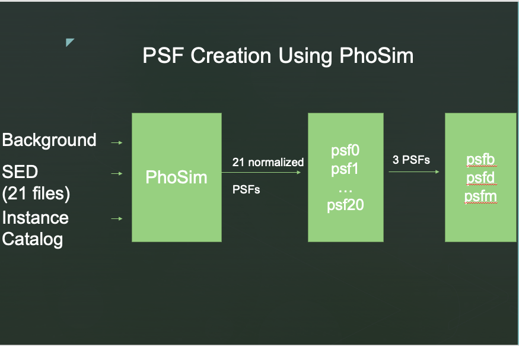
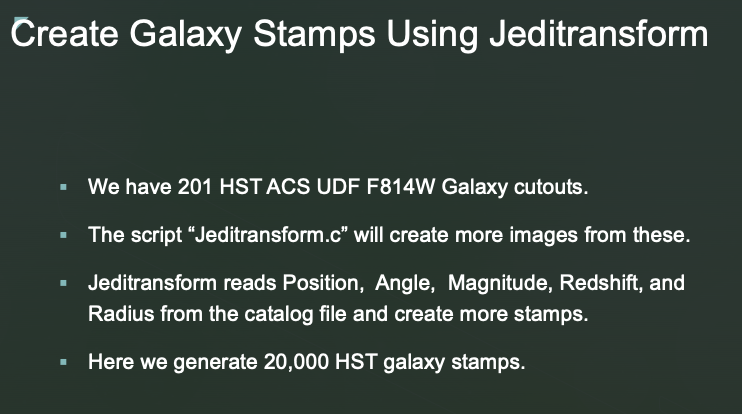
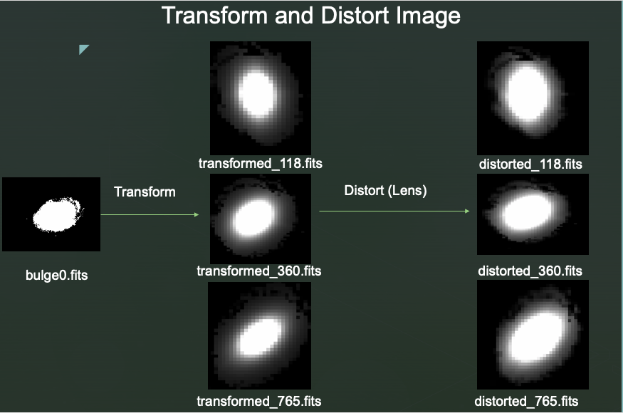
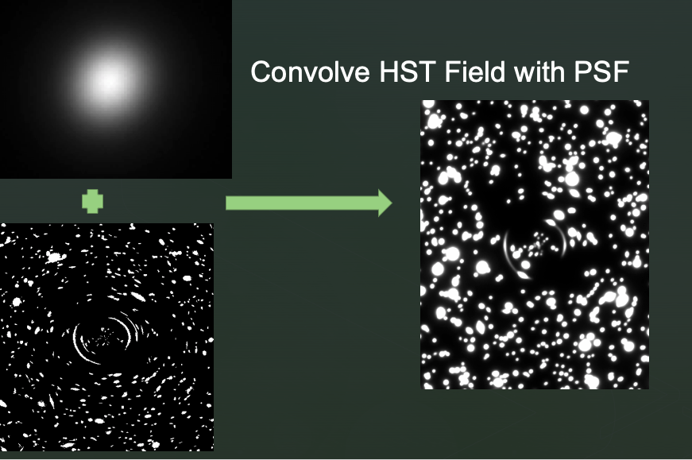
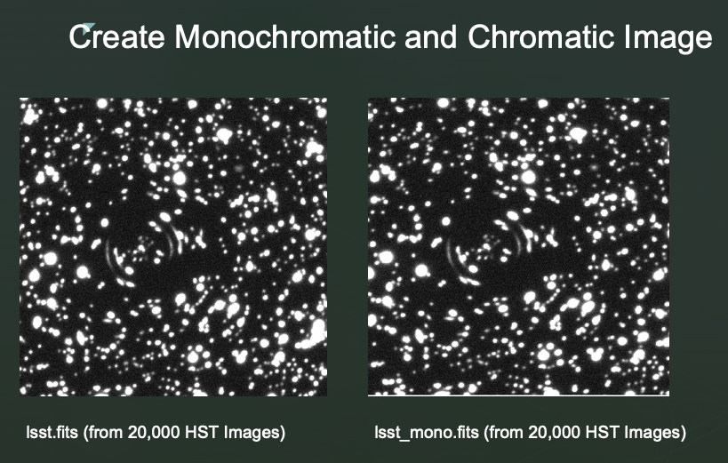

# Technical Notes
## Copyright
The C-programs and basic skeleton was  was developed by *Daniel Parker*  and *Ian Dell'Antonio* 
of Brown University circa 2013. I forked the project in 2014 and customized the project for the color dependent analysis.
I am maintaining this repo from 2014 (though I uploaded it very late) and is being changed constantly.
The original version jedisim is now being maintained by Robert Binyang Liu et. al. in another
[github repo](https://github.com/rbliu/jedisim).
